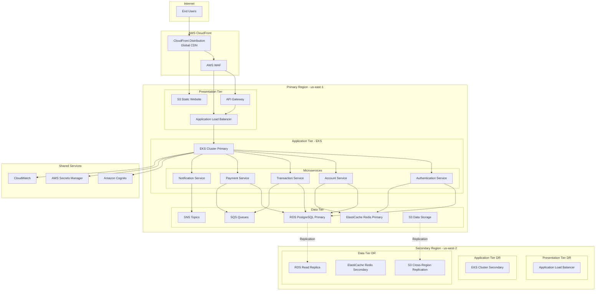

# Enterprise Financial Services Application - AWS Architecture Design

## Executive Summary

This document outlines the complete architecture for a 3-tier enterprise financial services application on AWS, designed to handle 50K-100K concurrent users with multi-region deployment, disaster recovery, and PCI-DSS compliance.

## Technology Stack

- **Frontend**: Angular 17+ with TypeScript
- **Backend**: Java Spring Boot 3.x with microservices architecture
- **Database**: Amazon RDS for PostgreSQL
- **Cache**: Amazon ElastiCache for Redis
- **Message Queue**: Amazon SQS and Amazon SNS
- **Container Orchestration**: Amazon Elastic Kubernetes Service (EKS)
- **CI/CD**: GitHub Actions with AWS CodeDeploy
- **IaC**: Terraform

## Architecture Overview



## 1. Presentation Tier Architecture

### 1.1 Amazon CloudFront
- **Purpose**: Global content delivery network
- **Features**:
  - Edge locations worldwide for low latency
  - SSL/TLS termination
  - DDoS protection with AWS Shield Standard
  - Custom domain with ACM certificates
  - Cache behaviors for static and dynamic content

**Configuration:**
```hcl
resource "aws_cloudfront_distribution" "main" {
  enabled             = true
  is_ipv6_enabled     = true
  comment             = "Financial Services CDN"
  default_root_object = "index.html"
  price_class         = "PriceClass_All"
  
  origin {
    domain_name = aws_s3_bucket.frontend.bucket_regional_domain_name
    origin_id   = "S3-Frontend"
    
    s3_origin_config {
      origin_access_identity = aws_cloudfront_origin_access_identity.main.cloudfront_access_identity_path
    }
  }
  
  origin {
    domain_name = aws_lb.main.dns_name
    origin_id   = "ALB-Backend"
    
    custom_origin_config {
      http_port              = 80
      https_port             = 443
      origin_protocol_policy = "https-only"
      origin_ssl_protocols   = ["TLSv1.2"]
    }
  }
  
  default_cache_behavior {
    allowed_methods        = ["GET", "HEAD", "OPTIONS"]
    cached_methods         = ["GET", "HEAD"]
    target_origin_id       = "S3-Frontend"
    viewer_protocol_policy = "redirect-to-https"
    compress               = true
    
    forwarded_values {
      query_string = false
      cookies {
        forward = "none"
      }
    }
    
    min_ttl     = 0
    default_ttl = 3600
    max_ttl     = 86400
  }
  
  ordered_cache_behavior {
    path_pattern           = "/api/*"
    allowed_methods        = ["DELETE", "GET", "HEAD", "OPTIONS", "PATCH", "POST", "PUT"]
    cached_methods         = ["GET", "HEAD"]
    target_origin_id       = "ALB-Backend"
    viewer_protocol_policy = "https-only"
    compress               = true
    
    forwarded_values {
      query_string = true
      headers      = ["Authorization", "Host"]
      cookies {
        forward = "all"
      }
    }
    
    min_ttl     = 0
    default_ttl = 0
    max_ttl     = 0
  }
  
  restrictions {
    geo_restriction {
      restriction_type = "none"
    }
  }
  
  viewer_certificate {
    acm_certificate_arn      = aws_acm_certificate.main.arn
    ssl_support_method       = "sni-only"
    minimum_protocol_version = "TLSv1.2_2021"
  }
  
  web_acl_id = aws_wafv2_web_acl.main.arn
}
```

### 1.2 AWS WAF (Web Application Firewall)
- **Purpose**: Protection against common web exploits
- **Features**:
  - OWASP Top 10 protection
  - Rate limiting per IP
  - Geo-blocking capabilities
  - Bot detection and mitigation
  - Custom rules for financial services

**Configuration:**
```hcl
resource "aws_wafv2_web_acl" "main" {
  name  = "financial-services-waf"
  scope = "CLOUDFRONT"
  
  default_action {
    allow {}
  }
  
  rule {
    name     = "RateLimitRule"
    priority = 1
    
    action {
      block {}
    }
    
    statement {
      rate_based_statement {
        limit              = 2000
        aggregate_key_type = "IP"
      }
    }
    
    visibility_config {
      cloudwatch_metrics_enabled = true
      metric_name                = "RateLimitRule"
      sampled_requests_enabled   = true
    }
  }
  
  rule {
    name     = "AWSManagedRulesCommonRuleSet"
    priority = 2
    
    override_action {
      none {}
    }
    
    statement {
      managed_rule_group_statement {
        name        = "AWSManagedRulesCommonRuleSet"
        vendor_name = "AWS"
      }
    }
    
    visibility_config {
      cloudwatch_metrics_enabled = true
      metric_name                = "AWSManagedRulesCommonRuleSetMetric"
      sampled_requests_enabled   = true
    }
  }
  
  rule {
    name     = "AWSManagedRulesKnownBadInputsRuleSet"
    priority = 3
    
    override_action {
      none {}
    }
    
    statement {
      managed_rule_group_statement {
        name        = "AWSManagedRulesKnownBadInputsRuleSet"
        vendor_name = "AWS"
      }
    }
    
    visibility_config {
      cloudwatch_metrics_enabled = true
      metric_name                = "AWSManagedRulesKnownBadInputsRuleSetMetric"
      sampled_requests_enabled   = true
    }
  }
  
  visibility_config {
    cloudwatch_metrics_enabled = true
    metric_name                = "FinancialServicesWAF"
    sampled_requests_enabled   = true
  }
}
```

### 1.3 Amazon API Gateway
- **Purpose**: API management and routing
- **Features**:
  - RESTful API endpoints
  - Request/response transformation
  - API versioning
  - Throttling and quotas
  - AWS Cognito integration
  - CloudWatch logging

**Configuration:**
```hcl
resource "aws_api_gateway_rest_api" "main" {
  name        = "financial-services-api"
  description = "Financial Services API Gateway"
  
  endpoint_configuration {
    types = ["REGIONAL"]
  }
}

resource "aws_api_gateway_authorizer" "cognito" {
  name          = "cognito-authorizer"
  rest_api_id   = aws_api_gateway_rest_api.main.id
  type          = "COGNITO_USER_POOLS"
  provider_arns = [aws_cognito_user_pool.main.arn]
}

resource "aws_api_gateway_resource" "api" {
  rest_api_id = aws_api_gateway_rest_api.main.id
  parent_id   = aws_api_gateway_rest_api.main.root_resource_id
  path_part   = "api"
}

resource "aws_api_gateway_method" "proxy" {
  rest_api_id   = aws_api_gateway_rest_api.main.id
  resource_id   = aws_api_gateway_resource.api.id
  http_method   = "ANY"
  authorization = "COGNITO_USER_POOLS"
  authorizer_id = aws_api_gateway_authorizer.cognito.id
}

resource "aws_api_gateway_integration" "alb" {
  rest_api_id = aws_api_gateway_rest_api.main.id
  resource_id = aws_api_gateway_resource.api.id
  http_method = aws_api_gateway_method.proxy.http_method
  
  type                    = "HTTP_PROXY"
  integration_http_method = "ANY"
  uri                     = "http://${aws_lb.main.dns_name}/{proxy}"
  
  request_parameters = {
    "integration.request.path.proxy" = "method.request.path.proxy"
  }
}
```

### 1.4 Application Load Balancer (ALB)
- **Purpose**: Regional load balancing for EKS services
- **Features**:
  - Layer 7 load balancing
  - SSL/TLS termination
  - Path-based routing
  - Health checks
  - Sticky sessions
  - Integration with AWS WAF

**Configuration:**
```hcl
resource "aws_lb" "main" {
  name               = "financial-services-alb"
  internal           = false
  load_balancer_type = "application"
  security_groups    = [aws_security_group.alb.id]
  subnets            = aws_subnet.public[*].id
  
  enable_deletion_protection = true
  enable_http2              = true
  enable_cross_zone_load_balancing = true
  
  tags = {
    Name = "financial-services-alb"
  }
}

resource "aws_lb_listener" "https" {
  load_balancer_arn = aws_lb.main.arn
  port              = "443"
  protocol          = "HTTPS"
  ssl_policy        = "ELBSecurityPolicy-TLS-1-2-2017-01"
  certificate_arn   = aws_acm_certificate.main.arn
  
  default_action {
    type             = "forward"
    target_group_arn = aws_lb_target_group.main.arn
  }
}

resource "aws_lb_listener" "http" {
  load_balancer_arn = aws_lb.main.arn
  port              = "80"
  protocol          = "HTTP"
  
  default_action {
    type = "redirect"
    
    redirect {
      port        = "443"
      protocol    = "HTTPS"
      status_code = "HTTP_301"
    }
  }
}

resource "aws_lb_target_group" "main" {
  name     = "financial-services-tg"
  port     = 80
  protocol = "HTTP"
  vpc_id   = aws_vpc.main.id
  
  health_check {
    enabled             = true
    healthy_threshold   = 2
    unhealthy_threshold = 2
    timeout             = 5
    interval            = 30
    path                = "/health"
    matcher             = "200"
  }
  
  stickiness {
    type            = "lb_cookie"
    cookie_duration = 86400
    enabled         = true
  }
}
```

### 1.5 Amazon S3 for Static Content
- **Purpose**: Host Angular frontend application
- **Features**:
  - Static website hosting
  - Versioning enabled
  - Cross-region replication
  - Lifecycle policies
  - CloudFront integration

**Configuration:**
```hcl
resource "aws_s3_bucket" "frontend" {
  bucket = "financial-services-frontend"
  
  tags = {
    Name = "Frontend Application"
  }
}

resource "aws_s3_bucket_versioning" "frontend" {
  bucket = aws_s3_bucket.frontend.id
  
  versioning_configuration {
    status = "Enabled"
  }
}

resource "aws_s3_bucket_website_configuration" "frontend" {
  bucket = aws_s3_bucket.frontend.id
  
  index_document {
    suffix = "index.html"
  }
  
  error_document {
    key = "index.html"
  }
}

resource "aws_s3_bucket_public_access_block" "frontend" {
  bucket = aws_s3_bucket.frontend.id
  
  block_public_acls       = true
  block_public_policy     = true
  ignore_public_acls      = true
  restrict_public_buckets = true
}

resource "aws_s3_bucket_policy" "frontend" {
  bucket = aws_s3_bucket.frontend.id
  
  policy = jsonencode({
    Version = "2012-10-17"
    Statement = [
      {
        Sid    = "AllowCloudFrontAccess"
        Effect = "Allow"
        Principal = {
          AWS = aws_cloudfront_origin_access_identity.main.iam_arn
        }
        Action   = "s3:GetObject"
        Resource = "${aws_s3_bucket.frontend.arn}/*"
      }
    ]
  })
}
```

## 2. Application Tier Architecture

### 2.1 Amazon EKS (Elastic Kubernetes Service)

#### Cluster Configuration
```hcl
resource "aws_eks_cluster" "main" {
  name     = "financial-services-eks"
  role_arn = aws_iam_role.eks_cluster.arn
  version  = "1.28"
  
  vpc_config {
    subnet_ids              = concat(aws_subnet.private[*].id, aws_subnet.public[*].id)
    endpoint_private_access = true
    endpoint_public_access  = true
    public_access_cidrs     = ["0.0.0.0/0"]
    security_group_ids      = [aws_security_group.eks_cluster.id]
  }
  
  enabled_cluster_log_types = ["api", "audit", "authenticator", "controllerManager", "scheduler"]
  
  encryption_config {
    provider {
      key_arn = aws_kms_key.eks.arn
    }
    resources = ["secrets"]
  }
  
  depends_on = [
    aws_iam_role_policy_attachment.eks_cluster_policy,
    aws_iam_role_policy_attachment.eks_vpc_resource_controller,
  ]
}

resource "aws_eks_node_group" "system" {
  cluster_name    = aws_eks_cluster.main.name
  node_group_name = "system-node-group"
  node_role_arn   = aws_iam_role.eks_node.arn
  subnet_ids      = aws_subnet.private[*].id
  
  instance_types = ["t3.large"]
  
  scaling_config {
    desired_size = 3
    max_size     = 6
    min_size     = 3
  }
  
  update_config {
    max_unavailable = 1
  }
  
  labels = {
    role = "system"
  }
  
  depends_on = [
    aws_iam_role_policy_attachment.eks_worker_node_policy,
    aws_iam_role_policy_attachment.eks_cni_policy,
    aws_iam_role_policy_attachment.eks_container_registry_policy,
  ]
}

resource "aws_eks_node_group" "application" {
  cluster_name    = aws_eks_cluster.main.name
  node_group_name = "application-node-group"
  node_role_arn   = aws_iam_role.eks_node.arn
  subnet_ids      = aws_subnet.private[*].id
  
  instance_types = ["m5.2xlarge"]
  
  scaling_config {
    desired_size = 6
    max_size     = 20
    min_size     = 6
  }
  
  update_config {
    max_unavailable = 2
  }
  
  labels = {
    role = "application"
  }
  
  tags = {
    "k8s.io/cluster-autoscaler/enabled"                      = "true"
    "k8s.io/cluster-autoscaler/${aws_eks_cluster.main.name}" = "owned"
  }
}
```

#### Microservices Architecture

##### Authentication Service
```yaml
apiVersion: apps/v1
kind: Deployment
metadata:
  name: auth-service
  namespace: financial-services
spec:
  replicas: 3
  selector:
    matchLabels:
      app: auth-service
  template:
    metadata:
      labels:
        app: auth-service
        version: v1
    spec:
      serviceAccountName: auth-service
      containers:
        - name: auth-service
          image: ${AWS_ACCOUNT_ID}.dkr.ecr.${AWS_REGION}.amazonaws.com/auth-service:latest
          ports:
            - containerPort: 8080
          env:
            - name: SPRING_PROFILES_ACTIVE
              value: "production"
            - name: DB_HOST
              valueFrom:
                secretKeyRef:
                  name: database-credentials
                  key: host
            - name: DB_PASSWORD
              valueFrom:
                secretKeyRef:
                  name: database-credentials
                  key: password
            - name: REDIS_HOST
              valueFrom:
                configMapKeyRef:
                  name: redis-config
                  key: host
            - name: AWS_REGION
              value: ${AWS_REGION}
          resources:
            requests:
              memory: "1Gi"
              cpu: "500m"
            limits:
              memory: "2Gi"
              cpu: "1000m"
          livenessProbe:
            httpGet:
              path: /actuator/health/liveness
              port: 8080
            initialDelaySeconds: 60
            periodSeconds: 10
          readinessProbe:
            httpGet:
              path: /actuator/health/readiness
              port: 8080
            initialDelaySeconds: 30
            periodSeconds: 5
---
apiVersion: v1
kind: Service
metadata:
  name: auth-service
  namespace: financial-services
spec:
  selector:
    app: auth-service
  ports:
    - protocol: TCP
      port: 80
      targetPort: 8080
  type: ClusterIP
---
apiVersion: autoscaling/v2
kind: HorizontalPodAutoscaler
metadata:
  name: auth-service-hpa
  namespace: financial-services
spec:
  scaleTargetRef:
    apiVersion: apps/v1
    kind: Deployment
    name: auth-service
  minReplicas: 3
  maxReplicas: 10
  metrics:
    - type: Resource
      resource:
        name: cpu
        target:
          type: Utilization
          averageUtilization: 70
    - type: Resource
      resource:
        name: memory
        target:
          type: Utilization
          averageUtilization: 80
```

Similar deployments would be created for:
- **Account Service** (5-15 replicas)
- **Transaction Service** (8-20 replicas)
- **Payment Service** (6-18 replicas)
- **Notification Service** (3-8 replicas)

### 2.2 Amazon ECR (Elastic Container Registry)
```hcl
resource "aws_ecr_repository" "services" {
  for_each = toset(["auth-service", "account-service", "transaction-service", "payment-service", "notification-service"])
  
  name                 = each.key
  image_tag_mutability = "MUTABLE"
  
  image_scanning_configuration {
    scan_on_push = true
  }
  
  encryption_configuration {
    encryption_type = "KMS"
    kms_key         = aws_kms_key.ecr.arn
  }
}

resource "aws_ecr_lifecycle_policy" "services" {
  for_each   = aws_ecr_repository.services
  repository = each.value.name
  
  policy = jsonencode({
    rules = [
      {
        rulePriority = 1
        description  = "Keep last 10 images"
        selection = {
          tagStatus     = "tagged"
          tagPrefixList = ["v"]
          countType     = "imageCountMoreThan"
          countNumber   = 10
        }
        action = {
          type = "expire"
        }
      }
    ]
  })
}
```

## 3. Data Tier Architecture

### 3.1 Amazon RDS for PostgreSQL

```hcl
resource "aws_db_subnet_group" "main" {
  name       = "financial-services-db-subnet"
  subnet_ids = aws_subnet.database[*].id
  
  tags = {
    Name = "Financial Services DB Subnet Group"
  }
}

resource "aws_db_instance" "primary" {
  identifier     = "financial-services-primary"
  engine         = "postgres"
  engine_version = "15.4"
  instance_class = "db.r6g.4xlarge"
  
  allocated_storage     = 2000
  max_allocated_storage = 5000
  storage_type          = "gp3"
  storage_encrypted     = true
  kms_key_id            = aws_kms_key.rds.arn
  
  db_name  = "financialdb"
  username = "dbadmin"
  password = random_password.db_password.result
  
  multi_az               = true
  db_subnet_group_name   = aws_db_subnet_group.main.name
  vpc_security_group_ids = [aws_security_group.rds.id]
  
  backup_retention_period = 35
  backup_window           = "03:00-04:00"
  maintenance_window      = "sun:04:00-sun:05:00"
  
  enabled_cloudwatch_logs_exports = ["postgresql", "upgrade"]
  
  performance_insights_enabled    = true
  performance_insights_kms_key_id = aws_kms_key.rds.arn
  
  deletion_protection = true
  skip_final_snapshot = false
  final_snapshot_identifier = "financial-services-final-snapshot"
  
  tags = {
    Name = "Financial Services Primary DB"
  }
}

resource "aws_db_instance" "read_replica_1" {
  identifier             = "financial-services-replica-1"
  replicate_source_db    = aws_db_instance.primary.identifier
  instance_class         = "db.r6g.4xlarge"
  
  auto_minor_version_upgrade = true
  publicly_accessible        = false
  
  performance_insights_enabled = true
  
  tags = {
    Name = "Financial Services Read Replica 1"
  }
}

resource "aws_db_instance" "read_replica_2" {
  identifier             = "financial-services-replica-2"
  replicate_source_db    = aws_db_instance.primary.identifier
  instance_class         = "db.r6g.4xlarge"
  
  auto_minor_version_upgrade = true
  publicly_accessible        = false
  
  performance_insights_enabled = true
  
  tags = {
    Name = "Financial Services Read Replica 2"
  }
}

# Cross-region read replica for DR
resource "aws_db_instance" "cross_region_replica" {
  provider = aws.secondary
  
  identifier             = "financial-services-dr-replica"
  replicate_source_db    = aws_db_instance.primary.arn
  instance_class         = "db.r6g.4xlarge"
  
  auto_minor_version_upgrade = true
  publicly_accessible        = false
  
  performance_insights_enabled = true
  
  tags = {
    Name = "Financial Services DR Replica"
  }
}
```

### 3.2 Amazon ElastiCache for Redis

```hcl
resource "aws_elasticache_subnet_group" "main" {
  name       = "financial-services-cache-subnet"
  subnet_ids = aws_subnet.cache[*].id
}

resource "aws_elasticache_replication_group" "main" {
  replication_group_id       = "financial-services-redis"
  replication_group_description = "Redis cluster for financial services"
  
  engine               = "redis"
  engine_version       = "7.0"
  node_type            = "cache.r6g.xlarge"
  num_cache_clusters   = 3
  parameter_group_name = aws_elasticache_parameter_group.main.name
  port                 = 6379
  
  subnet_group_name          = aws_elasticache_subnet_group.main.name
  security_group_ids         = [aws_security_group.redis.id]
  
  at_rest_encryption_enabled = true
  transit_encryption_enabled = true
  auth_token_enabled         = true
  auth_token                 = random_password.redis_password.result
  
  automatic_failover_enabled = true
  multi_az_enabled           = true
  
  snapshot_retention_limit = 5
  snapshot_window          = "03:00-05:00"
  maintenance_window       = "sun:05:00-sun:07:00"
  
  log_delivery_configuration {
    destination      = aws_cloudwatch_log_group.redis_slow_log.name
    destination_type = "cloudwatch-logs"
    log_format       = "json"
    log_type         = "slow-log"
  }
  
  tags = {
    Name = "Financial Services Redis Cluster"
  }
}

resource "aws_elasticache_parameter_group" "main" {
  name   = "financial-services-redis-params"
  family = "redis7"
  
  parameter {
    name  = "maxmemory-policy"
    value = "allkeys-lru"
  }
  
  parameter {
    name  = "timeout"
    value = "300"
  }
}
```

### 3.3 Amazon SQS and SNS

```hcl
# SQS Queues
resource "aws_sqs_queue" "transaction_queue" {
  name                       = "financial-services-transactions"
  delay_seconds              = 0
  max_message_size           = 262144
  message_retention_seconds  = 1209600  # 14 days
  receive_wait_time_seconds  = 10
  visibility_timeout_seconds = 300
  
  kms_master_key_id                 = aws_kms_key.sqs.id
  kms_data_key_reuse_period_seconds = 300
  
  redrive_policy = jsonencode({
    deadLetterTargetArn = aws_sqs_queue.transaction_dlq.arn
    maxReceiveCount     = 3
  })
}

resource "aws_sqs_queue" "transaction_dlq" {
  name                      = "financial-services-transactions-dlq"
  message_retention_seconds = 1209600
  
  kms_master_key_id = aws_kms_key.sqs.id
}

resource "aws_sqs_queue" "payment_queue" {
  name                       = "financial-services-payments"
  delay_seconds              = 0
  max_message_size           = 262144
  message_retention_seconds  = 1209600
  receive_wait_time_seconds  = 10
  visibility_timeout_seconds = 300
  
  kms_master_key_id = aws_kms_key.sqs.id
  
  redrive_policy = jsonencode({
    deadLetterTargetArn = aws_sqs_queue.payment_dlq.arn
    maxReceiveCount     = 3
  })
}

resource "aws_sqs_queue" "payment_dlq" {
  name                      = "financial-services-payments-dlq"
  message_retention_seconds = 1209600
  
  kms_master_key_id = aws_kms_key.sqs.id
}

# SNS Topics
resource "aws_sns_topic" "notifications" {
  name              = "financial-services-notifications"
  kms_master_key_id = aws_kms_key.sns.id
}

resource "aws_sns_topic_subscription" "notification_queue" {
  topic_arn = aws_sns_topic.notifications.arn
  protocol  = "sqs"
  endpoint  = aws_sqs_queue.notification_queue.arn
}
```

### 3.4 Amazon S3 for Data Storage

```hcl
resource "aws_s3_bucket" "data" {
  bucket = "financial-services-data-${data.aws_caller_identity.current.account_id}"
  
  tags = {
    Name = "Financial Services Data Storage"
  }
}

resource "aws_s3_bucket_versioning" "data" {
  bucket = aws_s3_bucket.data.id
  
  versioning_configuration {
    status = "Enabled"
  }
}

resource "aws_s3_bucket_server_side_encryption_configuration" "data" {
  bucket = aws_s3_bucket.data.id
  
  rule {
    apply_server_side_encryption_by_default {
      sse_algorithm     = "aws:kms"
      kms_master_key_id = aws_kms_key.s3.arn
    }
    bucket_key_enabled = true
  }
}

resource "aws_s3_bucket_lifecycle_configuration" "data" {
  bucket = aws_s3_bucket.data.id
  
  rule {
    id     = "archive-old-documents"
    status = "Enabled"
    
    filter {
      prefix = "documents/"
    }
    
    transition {
      days          = 90
      storage_class = "STANDARD_IA"
    }
    
    transition {
      days          = 365
      storage_class = "GLACIER"
    }
  }
  
  rule {
    id     = "delete-old-logs"
    status = "Enabled"
    
    filter {
      prefix = "logs/"
    }
    
    expiration {
      days = 90
    }
  }
}

resource "aws_s3_bucket_replication_configuration" "data" {
  bucket = aws_s3_bucket.data.id
  role   = aws_iam_role.s3_replication.arn
  
  rule {
    id     = "replicate-to-dr"
    status = "Enabled"
    
    destination {
      bucket        = aws_s3_bucket.data_dr.arn
      storage_class = "STANDARD"
      
      encryption_configuration {
        replica_kms_key_id = aws_kms_key.s3_dr.arn
      }
    }
  }
}
```

This is the first part of the AWS architecture document. Would you like me to continue with the remaining sections (Network Architecture, IAM, CI/CD with GitHub Actions, etc.)?


## 4. Network Architecture

### 4.1 VPC Design

```hcl
# Primary Region VPC (us-east-1)
resource "aws_vpc" "main" {
  cidr_block           = "10.0.0.0/16"
  enable_dns_hostnames = true
  enable_dns_support   = true
  
  tags = {
    Name = "financial-services-vpc-primary"
  }
}

# Public Subnets (for ALB, NAT Gateway)
resource "aws_subnet" "public" {
  count             = 3
  vpc_id            = aws_vpc.main.id
  cidr_block        = "10.0.${count.index}.0/24"
  availability_zone = data.aws_availability_zones.available.names[count.index]
  
  map_public_ip_on_launch = true
  
  tags = {
    Name                                           = "financial-services-public-${count.index + 1}"
    "kubernetes.io/role/elb"                       = "1"
    "kubernetes.io/cluster/financial-services-eks" = "shared"
  }
}

# Private Subnets (for EKS nodes)
resource "aws_subnet" "private" {
  count             = 3
  vpc_id            = aws_vpc.main.id
  cidr_block        = "10.0.${count.index + 10}.0/24"
  availability_zone = data.aws_availability_zones.available.names[count.index]
  
  tags = {
    Name                                           = "financial-services-private-${count.index + 1}"
    "kubernetes.io/role/internal-elb"              = "1"
    "kubernetes.io/cluster/financial-services-eks" = "shared"
  }
}

# Database Subnets
resource "aws_subnet" "database" {
  count             = 3
  vpc_id            = aws_vpc.main.id
  cidr_block        = "10.0.${count.index + 20}.0/24"
  availability_zone = data.aws_availability_zones.available.names[count.index]
  
  tags = {
    Name = "financial-services-database-${count.index + 1}"
  }
}

# Cache Subnets
resource "aws_subnet" "cache" {
  count             = 3
  vpc_id            = aws_vpc.main.id
  cidr_block        = "10.0.${count.index + 30}.0/24"
  availability_zone = data.aws_availability_zones.available.names[count.index]
  
  tags = {
    Name = "financial-services-cache-${count.index + 1}"
  }
}

# Internet Gateway
resource "aws_internet_gateway" "main" {
  vpc_id = aws_vpc.main.id
  
  tags = {
    Name = "financial-services-igw"
  }
}

# NAT Gateways (one per AZ for high availability)
resource "aws_eip" "nat" {
  count  = 3
  domain = "vpc"
  
  tags = {
    Name = "financial-services-nat-eip-${count.index + 1}"
  }
}

resource "aws_nat_gateway" "main" {
  count         = 3
  allocation_id = aws_eip.nat[count.index].id
  subnet_id     = aws_subnet.public[count.index].id
  
  tags = {
    Name = "financial-services-nat-${count.index + 1}"
  }
  
  depends_on = [aws_internet_gateway.main]
}

# Route Tables
resource "aws_route_table" "public" {
  vpc_id = aws_vpc.main.id
  
  route {
    cidr_block = "0.0.0.0/0"
    gateway_id = aws_internet_gateway.main.id
  }
  
  tags = {
    Name = "financial-services-public-rt"
  }
}

resource "aws_route_table" "private" {
  count  = 3
  vpc_id = aws_vpc.main.id
  
  route {
    cidr_block     = "0.0.0.0/0"
    nat_gateway_id = aws_nat_gateway.main[count.index].id
  }
  
  tags = {
    Name = "financial-services-private-rt-${count.index + 1}"
  }
}

# Route Table Associations
resource "aws_route_table_association" "public" {
  count          = 3
  subnet_id      = aws_subnet.public[count.index].id
  route_table_id = aws_route_table.public.id
}

resource "aws_route_table_association" "private" {
  count          = 3
  subnet_id      = aws_subnet.private[count.index].id
  route_table_id = aws_route_table.private[count.index].id
}
```

### 4.2 Security Groups

```hcl
# ALB Security Group
resource "aws_security_group" "alb" {
  name        = "financial-services-alb-sg"
  description = "Security group for Application Load Balancer"
  vpc_id      = aws_vpc.main.id
  
  ingress {
    description = "HTTPS from anywhere"
    from_port   = 443
    to_port     = 443
    protocol    = "tcp"
    cidr_blocks = ["0.0.0.0/0"]
  }
  
  ingress {
    description = "HTTP from anywhere"
    from_port   = 80
    to_port     = 80
    protocol    = "tcp"
    cidr_blocks = ["0.0.0.0/0"]
  }
  
  egress {
    description = "All outbound traffic"
    from_port   = 0
    to_port     = 0
    protocol    = "-1"
    cidr_blocks = ["0.0.0.0/0"]
  }
  
  tags = {
    Name = "financial-services-alb-sg"
  }
}

# EKS Cluster Security Group
resource "aws_security_group" "eks_cluster" {
  name        = "financial-services-eks-cluster-sg"
  description = "Security group for EKS cluster"
  vpc_id      = aws_vpc.main.id
  
  egress {
    from_port   = 0
    to_port     = 0
    protocol    = "-1"
    cidr_blocks = ["0.0.0.0/0"]
  }
  
  tags = {
    Name = "financial-services-eks-cluster-sg"
  }
}

# EKS Node Security Group
resource "aws_security_group" "eks_nodes" {
  name        = "financial-services-eks-nodes-sg"
  description = "Security group for EKS worker nodes"
  vpc_id      = aws_vpc.main.id
  
  ingress {
    description     = "Allow nodes to communicate with each other"
    from_port       = 0
    to_port         = 65535
    protocol        = "-1"
    self            = true
  }
  
  ingress {
    description     = "Allow pods to communicate with cluster API"
    from_port       = 443
    to_port         = 443
    protocol        = "tcp"
    security_groups = [aws_security_group.eks_cluster.id]
  }
  
  ingress {
    description     = "Allow ALB to reach pods"
    from_port       = 0
    to_port         = 65535
    protocol        = "tcp"
    security_groups = [aws_security_group.alb.id]
  }
  
  egress {
    from_port   = 0
    to_port     = 0
    protocol    = "-1"
    cidr_blocks = ["0.0.0.0/0"]
  }
  
  tags = {
    Name = "financial-services-eks-nodes-sg"
  }
}

# RDS Security Group
resource "aws_security_group" "rds" {
  name        = "financial-services-rds-sg"
  description = "Security group for RDS PostgreSQL"
  vpc_id      = aws_vpc.main.id
  
  ingress {
    description     = "PostgreSQL from EKS nodes"
    from_port       = 5432
    to_port         = 5432
    protocol        = "tcp"
    security_groups = [aws_security_group.eks_nodes.id]
  }
  
  egress {
    from_port   = 0
    to_port     = 0
    protocol    = "-1"
    cidr_blocks = ["0.0.0.0/0"]
  }
  
  tags = {
    Name = "financial-services-rds-sg"
  }
}

# ElastiCache Security Group
resource "aws_security_group" "redis" {
  name        = "financial-services-redis-sg"
  description = "Security group for ElastiCache Redis"
  vpc_id      = aws_vpc.main.id
  
  ingress {
    description     = "Redis from EKS nodes"
    from_port       = 6379
    to_port         = 6379
    protocol        = "tcp"
    security_groups = [aws_security_group.eks_nodes.id]
  }
  
  egress {
    from_port   = 0
    to_port     = 0
    protocol    = "-1"
    cidr_blocks = ["0.0.0.0/0"]
  }
  
  tags = {
    Name = "financial-services-redis-sg"
  }
}
```

### 4.3 VPC Peering (Primary to DR Region)

```hcl
# VPC Peering Connection
resource "aws_vpc_peering_connection" "primary_to_dr" {
  vpc_id      = aws_vpc.main.id
  peer_vpc_id = aws_vpc.dr.id
  peer_region = "us-west-2"
  auto_accept = false
  
  tags = {
    Name = "financial-services-vpc-peering"
  }
}

# Accept peering connection in DR region
resource "aws_vpc_peering_connection_accepter" "dr" {
  provider                  = aws.secondary
  vpc_peering_connection_id = aws_vpc_peering_connection.primary_to_dr.id
  auto_accept               = true
  
  tags = {
    Name = "financial-services-vpc-peering-accepter"
  }
}

# Add routes for peering
resource "aws_route" "primary_to_dr" {
  count                     = 3
  route_table_id            = aws_route_table.private[count.index].id
  destination_cidr_block    = aws_vpc.dr.cidr_block
  vpc_peering_connection_id = aws_vpc_peering_connection.primary_to_dr.id
}
```

## 5. Identity and Access Management

### 5.1 Amazon Cognito User Pool

```hcl
resource "aws_cognito_user_pool" "main" {
  name = "financial-services-users"
  
  username_attributes      = ["email"]
  auto_verified_attributes = ["email"]
  
  password_policy {
    minimum_length                   = 12
    require_lowercase                = true
    require_uppercase                = true
    require_numbers                  = true
    require_symbols                  = true
    temporary_password_validity_days = 7
  }
  
  mfa_configuration = "OPTIONAL"
  
  software_token_mfa_configuration {
    enabled = true
  }
  
  account_recovery_setting {
    recovery_mechanism {
      name     = "verified_email"
      priority = 1
    }
  }
  
  user_attribute_update_settings {
    attributes_require_verification_before_update = ["email"]
  }
  
  schema {
    name                = "email"
    attribute_data_type = "String"
    required            = true
    mutable             = true
  }
  
  schema {
    name                = "name"
    attribute_data_type = "String"
    required            = true
    mutable             = true
  }
  
  schema {
    name                = "role"
    attribute_data_type = "String"
    required            = false
    mutable             = true
  }
  
  tags = {
    Name = "Financial Services User Pool"
  }
}

resource "aws_cognito_user_pool_client" "main" {
  name         = "financial-services-client"
  user_pool_id = aws_cognito_user_pool.main.id
  
  generate_secret                      = true
  allowed_oauth_flows_user_pool_client = true
  allowed_oauth_flows                  = ["code", "implicit"]
  allowed_oauth_scopes                 = ["email", "openid", "profile"]
  callback_urls                        = ["https://app.financialservices.com/callback"]
  logout_urls                          = ["https://app.financialservices.com/logout"]
  
  supported_identity_providers = ["COGNITO"]
  
  token_validity_units {
    access_token  = "hours"
    id_token      = "hours"
    refresh_token = "days"
  }
  
  access_token_validity  = 1
  id_token_validity      = 1
  refresh_token_validity = 30
}

resource "aws_cognito_user_pool_domain" "main" {
  domain       = "financial-services-auth"
  user_pool_id = aws_cognito_user_pool.main.id
}
```

### 5.2 IAM Roles and Policies

```hcl
# EKS Cluster Role
resource "aws_iam_role" "eks_cluster" {
  name = "financial-services-eks-cluster-role"
  
  assume_role_policy = jsonencode({
    Version = "2012-10-17"
    Statement = [
      {
        Action = "sts:AssumeRole"
        Effect = "Allow"
        Principal = {
          Service = "eks.amazonaws.com"
        }
      }
    ]
  })
}

resource "aws_iam_role_policy_attachment" "eks_cluster_policy" {
  policy_arn = "arn:aws:iam::aws:policy/AmazonEKSClusterPolicy"
  role       = aws_iam_role.eks_cluster.name
}

resource "aws_iam_role_policy_attachment" "eks_vpc_resource_controller" {
  policy_arn = "arn:aws:iam::aws:policy/AmazonEKSVPCResourceController"
  role       = aws_iam_role.eks_cluster.name
}

# EKS Node Role
resource "aws_iam_role" "eks_node" {
  name = "financial-services-eks-node-role"
  
  assume_role_policy = jsonencode({
    Version = "2012-10-17"
    Statement = [
      {
        Action = "sts:AssumeRole"
        Effect = "Allow"
        Principal = {
          Service = "ec2.amazonaws.com"
        }
      }
    ]
  })
}

resource "aws_iam_role_policy_attachment" "eks_worker_node_policy" {
  policy_arn = "arn:aws:iam::aws:policy/AmazonEKSWorkerNodePolicy"
  role       = aws_iam_role.eks_node.name
}

resource "aws_iam_role_policy_attachment" "eks_cni_policy" {
  policy_arn = "arn:aws:iam::aws:policy/AmazonEKS_CNI_Policy"
  role       = aws_iam_role.eks_node.name
}

resource "aws_iam_role_policy_attachment" "eks_container_registry_policy" {
  policy_arn = "arn:aws:iam::aws:policy/AmazonEC2ContainerRegistryReadOnly"
  role       = aws_iam_role.eks_node.name
}

# Service Account IAM Role (IRSA)
resource "aws_iam_role" "service_account" {
  name = "financial-services-sa-role"
  
  assume_role_policy = jsonencode({
    Version = "2012-10-17"
    Statement = [
      {
        Action = "sts:AssumeRoleWithWebIdentity"
        Effect = "Allow"
        Principal = {
          Federated = aws_iam_openid_connect_provider.eks.arn
        }
        Condition = {
          StringEquals = {
            "${replace(aws_iam_openid_connect_provider.eks.url, "https://", "")}:sub" = "system:serviceaccount:financial-services:app-service-account"
          }
        }
      }
    ]
  })
}

# Custom policy for accessing AWS services
resource "aws_iam_policy" "service_account_policy" {
  name        = "financial-services-sa-policy"
  description = "Policy for financial services application"
  
  policy = jsonencode({
    Version = "2012-10-17"
    Statement = [
      {
        Effect = "Allow"
        Action = [
          "secretsmanager:GetSecretValue",
          "secretsmanager:DescribeSecret"
        ]
        Resource = "arn:aws:secretsmanager:*:*:secret:financial-services/*"
      },
      {
        Effect = "Allow"
        Action = [
          "sqs:SendMessage",
          "sqs:ReceiveMessage",
          "sqs:DeleteMessage",
          "sqs:GetQueueAttributes"
        ]
        Resource = "arn:aws:sqs:*:*:financial-services-*"
      },
      {
        Effect = "Allow"
        Action = [
          "sns:Publish"
        ]
        Resource = "arn:aws:sns:*:*:financial-services-*"
      },
      {
        Effect = "Allow"
        Action = [
          "s3:GetObject",
          "s3:PutObject",
          "s3:DeleteObject"
        ]
        Resource = "arn:aws:s3:::financial-services-data-*/*"
      },
      {
        Effect = "Allow"
        Action = [
          "kms:Decrypt",
          "kms:Encrypt",
          "kms:GenerateDataKey"
        ]
        Resource = "*"
      }
    ]
  })
}

resource "aws_iam_role_policy_attachment" "service_account_policy" {
  policy_arn = aws_iam_policy.service_account_policy.arn
  role       = aws_iam_role.service_account.name
}

# OIDC Provider for EKS
data "tls_certificate" "eks" {
  url = aws_eks_cluster.main.identity[0].oidc[0].issuer
}

resource "aws_iam_openid_connect_provider" "eks" {
  client_id_list  = ["sts.amazonaws.com"]
  thumbprint_list = [data.tls_certificate.eks.certificates[0].sha1_fingerprint]
  url             = aws_eks_cluster.main.identity[0].oidc[0].issuer
}
```

### 5.3 AWS Secrets Manager

```hcl
resource "aws_secretsmanager_secret" "database_credentials" {
  name                    = "financial-services/database/credentials"
  description             = "Database credentials for financial services"
  recovery_window_in_days = 30
  
  kms_key_id = aws_kms_key.secrets.id
}

resource "aws_secretsmanager_secret_version" "database_credentials" {
  secret_id = aws_secretsmanager_secret.database_credentials.id
  secret_string = jsonencode({
    username = aws_db_instance.primary.username
    password = random_password.db_password.result
    host     = aws_db_instance.primary.endpoint
    port     = aws_db_instance.primary.port
    dbname   = aws_db_instance.primary.db_name
  })
}

resource "aws_secretsmanager_secret" "redis_credentials" {
  name                    = "financial-services/redis/credentials"
  description             = "Redis credentials for financial services"
  recovery_window_in_days = 30
  
  kms_key_id = aws_kms_key.secrets.id
}

resource "aws_secretsmanager_secret_version" "redis_credentials" {
  secret_id = aws_secretsmanager_secret.redis_credentials.id
  secret_string = jsonencode({
    host     = aws_elasticache_replication_group.main.primary_endpoint_address
    port     = aws_elasticache_replication_group.main.port
    password = random_password.redis_password.result
  })
}

resource "aws_secretsmanager_secret" "jwt_secret" {
  name                    = "financial-services/jwt/secret"
  description             = "JWT secret for financial services"
  recovery_window_in_days = 30
  
  kms_key_id = aws_kms_key.secrets.id
}

resource "aws_secretsmanager_secret_version" "jwt_secret" {
  secret_id     = aws_secretsmanager_secret.jwt_secret.id
  secret_string = random_password.jwt_secret.result
}
```

## 6. Monitoring and Observability

### 6.1 Amazon CloudWatch

```hcl
# Log Groups
resource "aws_cloudwatch_log_group" "eks_cluster" {
  name              = "/aws/eks/financial-services/cluster"
  retention_in_days = 90
  kms_key_id        = aws_kms_key.cloudwatch.arn
}

resource "aws_cloudwatch_log_group" "application" {
  name              = "/aws/eks/financial-services/application"
  retention_in_days = 90
  kms_key_id        = aws_kms_key.cloudwatch.arn
}

resource "aws_cloudwatch_log_group" "rds" {
  name              = "/aws/rds/financial-services"
  retention_in_days = 90
  kms_key_id        = aws_kms_key.cloudwatch.arn
}

# CloudWatch Alarms
resource "aws_cloudwatch_metric_alarm" "high_cpu" {
  alarm_name          = "financial-services-high-cpu"
  comparison_operator = "GreaterThanThreshold"
  evaluation_periods  = "2"
  metric_name         = "CPUUtilization"
  namespace           = "AWS/EKS"
  period              = "300"
  statistic           = "Average"
  threshold           = "80"
  alarm_description   = "This metric monitors EKS CPU utilization"
  alarm_actions       = [aws_sns_topic.alerts.arn]
  
  dimensions = {
    ClusterName = aws_eks_cluster.main.name
  }
}

resource "aws_cloudwatch_metric_alarm" "high_memory" {
  alarm_name          = "financial-services-high-memory"
  comparison_operator = "GreaterThanThreshold"
  evaluation_periods  = "2"
  metric_name         = "MemoryUtilization"
  namespace           = "AWS/EKS"
  period              = "300"
  statistic           = "Average"
  threshold           = "85"
  alarm_description   = "This metric monitors EKS memory utilization"
  alarm_actions       = [aws_sns_topic.alerts.arn]
  
  dimensions = {
    ClusterName = aws_eks_cluster.main.name
  }
}

resource "aws_cloudwatch_metric_alarm" "rds_cpu" {
  alarm_name          = "financial-services-rds-high-cpu"
  comparison_operator = "GreaterThanThreshold"
  evaluation_periods  = "2"
  metric_name         = "CPUUtilization"
  namespace           = "AWS/RDS"
  period              = "300"
  statistic           = "Average"
  threshold           = "80"
  alarm_description   = "This metric monitors RDS CPU utilization"
  alarm_actions       = [aws_sns_topic.alerts.arn]
  
  dimensions = {
    DBInstanceIdentifier = aws_db_instance.primary.id
  }
}

resource "aws_cloudwatch_metric_alarm" "rds_connections" {
  alarm_name          = "financial-services-rds-high-connections"
  comparison_operator = "GreaterThanThreshold"
  evaluation_periods  = "2"
  metric_name         = "DatabaseConnections"
  namespace           = "AWS/RDS"
  period              = "300"
  statistic           = "Average"
  threshold           = "450"
  alarm_description   = "This metric monitors RDS connection count"
  alarm_actions       = [aws_sns_topic.alerts.arn]
  
  dimensions = {
    DBInstanceIdentifier = aws_db_instance.primary.id
  }
}

# SNS Topic for Alerts
resource "aws_sns_topic" "alerts" {
  name              = "financial-services-alerts"
  kms_master_key_id = aws_kms_key.sns.id
}

resource "aws_sns_topic_subscription" "alerts_email" {
  topic_arn = aws_sns_topic.alerts.arn
  protocol  = "email"
  endpoint  = "devops@company.com"
}
```

### 6.2 AWS X-Ray for Distributed Tracing

```yaml
# X-Ray DaemonSet for EKS
apiVersion: apps/v1
kind: DaemonSet
metadata:
  name: xray-daemon
  namespace: kube-system
spec:
  selector:
    matchLabels:
      app: xray-daemon
  template:
    metadata:
      labels:
        app: xray-daemon
    spec:
      serviceAccountName: xray-daemon
      containers:
        - name: xray-daemon
          image: amazon/aws-xray-daemon:latest
          ports:
            - containerPort: 2000
              protocol: UDP
          resources:
            limits:
              memory: 256Mi
            requests:
              cpu: 100m
              memory: 256Mi
---
apiVersion: v1
kind: Service
metadata:
  name: xray-service
  namespace: kube-system
spec:
  selector:
    app: xray-daemon
  ports:
    - port: 2000
      protocol: UDP
      targetPort: 2000
  type: ClusterIP
```

### 6.3 Container Insights

```hcl
# Enable Container Insights
resource "aws_eks_addon" "cloudwatch_observability" {
  cluster_name = aws_eks_cluster.main.name
  addon_name   = "amazon-cloudwatch-observability"
  
  addon_version = "v1.2.0-eksbuild.1"
  
  resolve_conflicts_on_create = "OVERWRITE"
  resolve_conflicts_on_update = "OVERWRITE"
}
```

## 7. Security and Encryption

### 7.1 KMS Keys

```hcl
# EKS Encryption Key
resource "aws_kms_key" "eks" {
  description             = "KMS key for EKS cluster encryption"
  deletion_window_in_days = 30
  enable_key_rotation     = true
  
  tags = {
    Name = "financial-services-eks-key"
  }
}

resource "aws_kms_alias" "eks" {
  name          = "alias/financial-services-eks"
  target_key_id = aws_kms_key.eks.key_id
}

# RDS Encryption Key
resource "aws_kms_key" "rds" {
  description             = "KMS key for RDS encryption"
  deletion_window_in_days = 30
  enable_key_rotation     = true
  
  tags = {
    Name = "financial-services-rds-key"
  }
}

# S3 Encryption Key
resource "aws_kms_key" "s3" {
  description             = "KMS key for S3 encryption"
  deletion_window_in_days = 30
  enable_key_rotation     = true
  
  tags = {
    Name = "financial-services-s3-key"
  }
}

# Secrets Manager Encryption Key
resource "aws_kms_key" "secrets" {
  description             = "KMS key for Secrets Manager"
  deletion_window_in_days = 30
  enable_key_rotation     = true
  
  tags = {
    Name = "financial-services-secrets-key"
  }
}

# CloudWatch Logs Encryption Key
resource "aws_kms_key" "cloudwatch" {
  description             = "KMS key for CloudWatch Logs"
  deletion_window_in_days = 30
  enable_key_rotation     = true
  
  policy = jsonencode({
    Version = "2012-10-17"
    Statement = [
      {
        Sid    = "Enable IAM User Permissions"
        Effect = "Allow"
        Principal = {
          AWS = "arn:aws:iam::${data.aws_caller_identity.current.account_id}:root"
        }
        Action   = "kms:*"
        Resource = "*"
      },
      {
        Sid    = "Allow CloudWatch Logs"
        Effect = "Allow"
        Principal = {
          Service = "logs.${data.aws_region.current.name}.amazonaws.com"
        }
        Action = [
          "kms:Encrypt",
          "kms:Decrypt",
          "kms:ReEncrypt*",
          "kms:GenerateDataKey*",
          "kms:CreateGrant",
          "kms:DescribeKey"
        ]
        Resource = "*"
        Condition = {
          ArnLike = {
            "kms:EncryptionContext:aws:logs:arn" = "arn:aws:logs:${data.aws_region.current.name}:${data.aws_caller_identity.current.account_id}:*"
          }
        }
      }
    ]
  })
  
  tags = {
    Name = "financial-services-cloudwatch-key"
  }
}
```

### 7.2 AWS Config for Compliance

```hcl
resource "aws_config_configuration_recorder" "main" {
  name     = "financial-services-config-recorder"
  role_arn = aws_iam_role.config.arn
  
  recording_group {
    all_supported                 = true
    include_global_resource_types = true
  }
}

resource "aws_config_delivery_channel" "main" {
  name           = "financial-services-config-delivery"
  s3_bucket_name = aws_s3_bucket.config.bucket
  
  depends_on = [aws_config_configuration_recorder.main]
}

resource "aws_config_configuration_recorder_status" "main" {
  name       = aws_config_configuration_recorder.main.name
  is_enabled = true
  
  depends_on = [aws_config_delivery_channel.main]
}

# Config Rules for PCI-DSS Compliance
resource "aws_config_config_rule" "encrypted_volumes" {
  name = "encrypted-volumes"
  
  source {
    owner             = "AWS"
    source_identifier = "ENCRYPTED_VOLUMES"
  }
  
  depends_on = [aws_config_configuration_recorder.main]
}

resource "aws_config_config_rule" "rds_encryption_enabled" {
  name = "rds-storage-encrypted"
  
  source {
    owner             = "AWS"
    source_identifier = "RDS_STORAGE_ENCRYPTED"
  }
  
  depends_on = [aws_config_configuration_recorder.main]
}

resource "aws_config_config_rule" "s3_bucket_encryption" {
  name = "s3-bucket-server-side-encryption-enabled"
  
  source {
    owner             = "AWS"
    source_identifier = "S3_BUCKET_SERVER_SIDE_ENCRYPTION_ENABLED"
  }
  
  depends_on = [aws_config_configuration_recorder.main]
}
```

This completes the main AWS architecture document. Would you like me to continue creating the GitHub Actions CI/CD pipeline document and Terraform deployment scripts?
