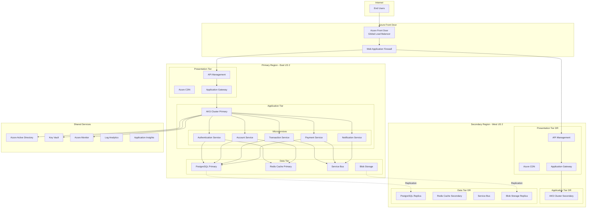
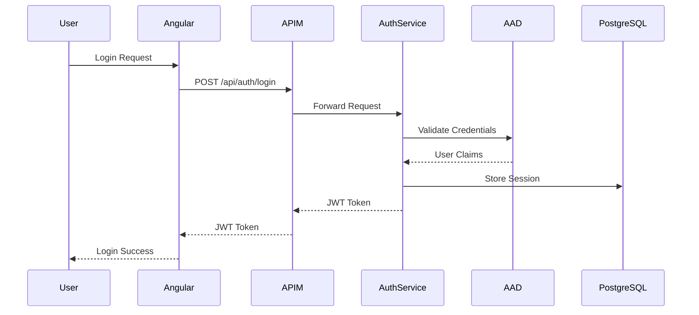

# Enterprise Financial Services Application - Azure Architecture Design

## Executive Summary

This document outlines the complete architecture for a 3-tier enterprise financial services application on Azure, designed to handle 50K-100K concurrent users with multi-region deployment, disaster recovery, and PCI-DSS compliance.

## Technology Stack

- **Frontend**: Angular 17+ with TypeScript
- **Backend**: Java Spring Boot 3.x with microservices architecture
- **Database**: Azure Database for PostgreSQL Flexible Server
- **Cache**: Azure Cache for Redis
- **Message Queue**: Azure Service Bus
- **Container Orchestration**: Azure Kubernetes Service (AKS)
- **CI/CD**: Azure DevOps with GitHub integration
- **IaC**: Terraform with Azure Bicep modules

## Architecture Overview



## 1. Presentation Tier Architecture

### 1.1 Azure Front Door
- **Purpose**: Global load balancing and traffic routing
- **Features**:
  - SSL/TLS termination
  - DDoS protection (Standard tier)
  - Health probe monitoring
  - Session affinity
  - URL-based routing

### 1.2 Web Application Firewall (WAF)
- **Purpose**: Protection against OWASP Top 10 vulnerabilities
- **Configuration**:
  - Custom rules for financial services
  - Rate limiting per IP
  - Geo-filtering capabilities
  - Bot protection

### 1.3 Azure API Management
- **Purpose**: API gateway and management
- **Features**:
  - API versioning and lifecycle management
  - OAuth 2.0 and OpenID Connect integration
  - Rate limiting and quotas
  - Request/response transformation
  - API analytics and monitoring
  - Developer portal for API documentation

### 1.4 Azure CDN
- **Purpose**: Static content delivery
- **Configuration**:
  - Angular application bundles
  - Static assets (images, CSS, JS)
  - Custom domain with SSL
  - Cache rules optimization
  - Compression enabled

### 1.5 Application Gateway
- **Purpose**: Regional load balancing
- **Features**:
  - Layer 7 load balancing
  - SSL offloading
  - Cookie-based session affinity
  - URL path-based routing
  - Health probes for backend pools

## 2. Application Tier Architecture

### 2.1 Azure Kubernetes Service (AKS)

#### Cluster Configuration
- **Node Pools**:
  - System node pool: 3 nodes (Standard_D4s_v3)
  - User node pool: 6-20 nodes with autoscaling (Standard_D8s_v3)
  - Spot instance pool for non-critical workloads
- **Networking**: Azure CNI with network policies
- **Availability**: Multi-zone deployment across 3 availability zones
- **Security**: Azure AD integration, RBAC enabled, Pod Security Standards

#### Microservices Architecture

##### Authentication Service
- **Responsibilities**:
  - User authentication and authorization
  - JWT token generation and validation
  - Multi-factor authentication (MFA)
  - Session management
- **Technology**: Spring Security, OAuth 2.0, OpenID Connect
- **Scaling**: 3-10 replicas with HPA

##### Account Service
- **Responsibilities**:
  - Account creation and management
  - Account balance inquiries
  - Account statements
  - Customer profile management
- **Technology**: Spring Boot, JPA/Hibernate
- **Scaling**: 5-15 replicas with HPA

##### Transaction Service
- **Responsibilities**:
  - Transaction processing
  - Transaction history
  - Transaction validation
  - Fraud detection integration
- **Technology**: Spring Boot, Event Sourcing pattern
- **Scaling**: 8-20 replicas with HPA

##### Payment Service
- **Responsibilities**:
  - Payment processing
  - Payment gateway integration
  - Payment reconciliation
  - Refund processing
- **Technology**: Spring Boot, Saga pattern for distributed transactions
- **Scaling**: 6-18 replicas with HPA

##### Notification Service
- **Responsibilities**:
  - Email notifications
  - SMS notifications
  - Push notifications
  - Alert management
- **Technology**: Spring Boot, Azure Communication Services
- **Scaling**: 3-8 replicas with HPA

### 2.2 Service Mesh (Istio)
- **Purpose**: Service-to-service communication management
- **Features**:
  - Mutual TLS between services
  - Traffic management and routing
  - Circuit breaking and retries
  - Observability and tracing
  - A/B testing and canary deployments

### 2.3 API Gateway Pattern
- **Implementation**: Spring Cloud Gateway
- **Features**:
  - Request routing
  - Load balancing
  - Circuit breaker (Resilience4j)
  - Rate limiting
  - Request/response logging

## 3. Data Tier Architecture

### 3.1 Azure Database for PostgreSQL Flexible Server

#### Primary Database Configuration
- **Tier**: Business Critical
- **Compute**: 16 vCores, 64 GB RAM
- **Storage**: 2 TB with auto-grow enabled
- **Backup**: 35-day retention, geo-redundant
- **High Availability**: Zone-redundant HA enabled
- **Version**: PostgreSQL 15

#### Database Design
```sql
-- Core schemas
- authentication_schema (users, roles, permissions)
- account_schema (accounts, customers, profiles)
- transaction_schema (transactions, transaction_logs)
- payment_schema (payments, payment_methods, gateways)
- audit_schema (audit_logs, compliance_logs)
```

#### Read Replicas
- **Primary Region**: 2 read replicas for read-heavy operations
- **Secondary Region**: 1 read replica for disaster recovery
- **Configuration**: Asynchronous replication with minimal lag

#### Connection Pooling
- **Implementation**: HikariCP
- **Configuration**:
  - Maximum pool size: 50 per service instance
  - Connection timeout: 30 seconds
  - Idle timeout: 10 minutes
  - Validation query enabled

### 3.2 Azure Cache for Redis

#### Configuration
- **Tier**: Premium P3 (26 GB)
- **Clustering**: Enabled with 3 shards
- **Persistence**: RDB and AOF enabled
- **Geo-replication**: Active-passive to secondary region
- **Network**: Private endpoint enabled

#### Caching Strategy
- **Session Cache**: User sessions with 30-minute TTL
- **Data Cache**: Frequently accessed data (account balances, user profiles)
- **Distributed Lock**: For transaction processing
- **Rate Limiting**: API rate limit counters

### 3.3 Azure Service Bus

#### Configuration
- **Tier**: Premium (4 messaging units)
- **Features**:
  - Geo-disaster recovery enabled
  - Duplicate detection
  - Dead-letter queues
  - Message sessions for ordered processing

#### Queue Design
- **transaction-queue**: Transaction processing requests
- **payment-queue**: Payment processing requests
- **notification-queue**: Notification delivery requests
- **audit-queue**: Audit log processing
- **dlq-queue**: Dead letter queue for failed messages

### 3.4 Azure Blob Storage

#### Configuration
- **Tier**: Premium Block Blobs
- **Replication**: Geo-zone-redundant storage (GZRS)
- **Access Tier**: Hot tier for active documents
- **Lifecycle Management**: Move to cool tier after 90 days

#### Storage Containers
- **documents**: Customer documents and statements
- **backups**: Database and application backups
- **logs**: Application and audit logs
- **reports**: Generated reports and analytics

## 4. Network Architecture

### 4.1 Virtual Network Design

#### Primary Region (East US 2)
```
VNet: financial-app-vnet-primary (10.0.0.0/16)
├── Subnet: aks-subnet (10.0.0.0/20) - 4094 IPs
├── Subnet: appgw-subnet (10.0.16.0/24) - 254 IPs
├── Subnet: apim-subnet (10.0.17.0/24) - 254 IPs
├── Subnet: data-subnet (10.0.18.0/24) - 254 IPs
├── Subnet: bastion-subnet (10.0.19.0/27) - 30 IPs
└── Subnet: private-endpoint-subnet (10.0.20.0/24) - 254 IPs
```

#### Secondary Region (West US 2)
```
VNet: financial-app-vnet-secondary (10.1.0.0/16)
├── Subnet: aks-subnet (10.1.0.0/20) - 4094 IPs
├── Subnet: appgw-subnet (10.1.16.0/24) - 254 IPs
├── Subnet: apim-subnet (10.1.17.0/24) - 254 IPs
├── Subnet: data-subnet (10.1.18.0/24) - 254 IPs
├── Subnet: bastion-subnet (10.1.19.0/27) - 30 IPs
└── Subnet: private-endpoint-subnet (10.1.20.0/24) - 254 IPs
```

### 4.2 Network Security Groups (NSGs)

#### AKS Subnet NSG
- Allow inbound from Application Gateway subnet
- Allow outbound to data subnet
- Allow outbound to Azure services (AAD, Key Vault, ACR)
- Deny all other inbound traffic

#### Data Subnet NSG
- Allow inbound from AKS subnet only
- Deny all other inbound traffic
- Allow outbound for replication

### 4.3 Private Endpoints
- PostgreSQL database
- Redis cache
- Storage accounts
- Key Vault
- Azure Container Registry

### 4.4 VNet Peering
- Hub-spoke topology
- Primary to secondary region peering for DR
- Transit through Azure Firewall

## 5. Identity and Access Management

### 5.1 Azure Active Directory Integration

#### Authentication Flow


#### Configuration
- **Tenant**: Dedicated Azure AD tenant
- **App Registrations**: Separate for each microservice
- **Conditional Access**: MFA required for sensitive operations
- **Identity Protection**: Risk-based policies enabled

### 5.2 Managed Identities
- **System-assigned**: For AKS cluster
- **User-assigned**: For microservices accessing Azure resources
- **Permissions**: Least privilege principle

### 5.3 Role-Based Access Control (RBAC)

#### Application Roles
- **Customer**: Basic banking operations
- **Premium Customer**: Advanced features
- **Teller**: Branch operations
- **Manager**: Approval workflows
- **Administrator**: System configuration
- **Auditor**: Read-only access to audit logs

#### Azure RBAC
- **Subscription**: Owner, Contributor, Reader
- **Resource Groups**: Custom roles per environment
- **AKS**: Cluster Admin, Cluster User
- **Database**: Custom roles for each microservice